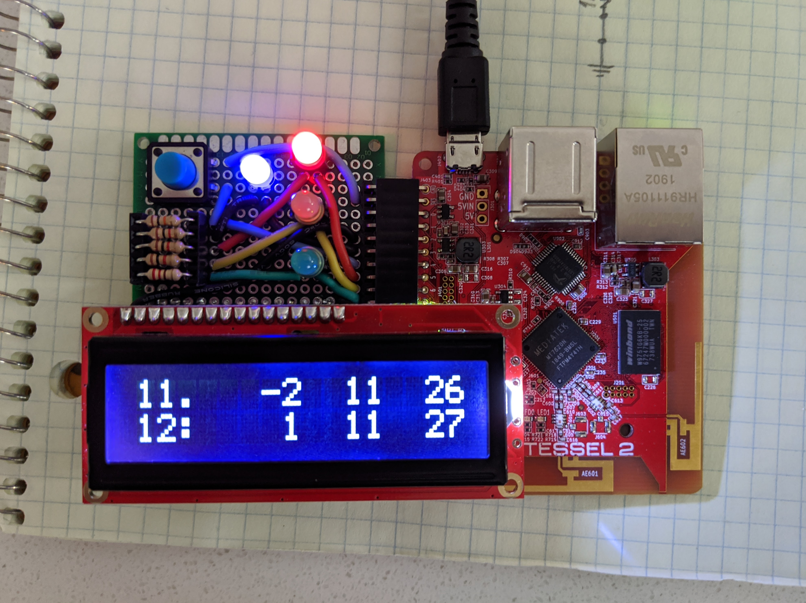
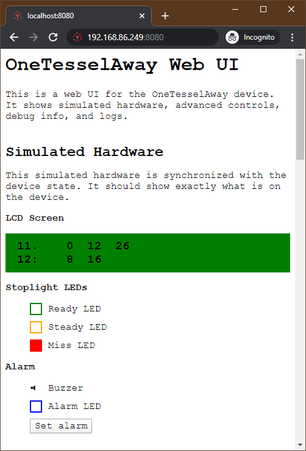

# OneTesselAway: Real-Time Public Transit Status IoT Device

> A real-time public transit status IoT device built with Node.js, the OneBusAway API, and a Tessel 2.

I built a real-time transit IoT device that tells me when my next bus will arrive. Built with Node.js, [OneBusAway](https://onebusaway.org/), and the [Tessel 2](https://tessel.io/). Why? Because constantly checking my phone and the OneBusAway app every morning while waiting for the bus was annoying. I also wanted to challenge myself by learning new hardware programming and electronics assembly skills.

👉👉 **To learn more about how I built this, please see [OneTesselAway: Building a Real-Time Public Transit Status IoT Device](https://medium.com/@robert.mcgui/onetesselaway-public-transit-status-iot-device-70b80ab8475b)**.



> Photo of the device. Bus #11 left 2 minutes ago, but there are other ones coming in 11 and 26 minutes

This device includes a web UI that includes real-time simulated hardware, advanced device controls, device logs, and more. It can also be run in "web only" mode which uses a full set of mocked hardware. By default, it runs on port 8080.



## Development

Here's how to develop on the OneTesselAway device and/or the web UI.

### Prerequisites

1. [Request](https://www.soundtransit.org/help-contacts/business-information/open-transit-data-otd) a OneBusAway API key. (This step can take a few days.)

> To request an API key for the Puget Sound One Bus Away data send an email to oba_api_key@soundtransit.org. Please include the first and last names of the contact person, email address (if different) and acknowledgement that you have read and agree to the Transit Data Terms of Use. Please allow two business days for processing requests.

2. Put the API key in a file called `oba-api-key.json` at the root of the project under an `apiKey` property.

```json
{
    "apiKey": "xxxxxxxx-xxxx-xxxx-xxxx-xxxxxxxxxxxx"
}
```

3. Install [NVM](https://github.com/nvm-sh/nvm)
4. Use `nvm use` to activate the latest version of Node supported by the Tessel
5. Install the [Tessel 2 CLI](https://tessel.gitbooks.io/t2-docs/content/API/CLI.html#installation)

### Run the Web UI from your Computer (No Device Required!)

You can run the OneTesselAway Web UI from your computer without any hardware at all.

    npm start

You can use the following environment variables to configure how the Web UI runs.

-   `WEB_UI_ADDRESS` - The address on which to run the Web UI
-   `WEB_UI_PORT` - The port on which to run the Web UI

E.g., to run the web UI on a different port:

    WEB_UI_PORT=8081 npm start

### Start OneTesselAway on the Device from your Computer

You can run OneTesselAway on the actual Tessel 2 hardware when connected via USB. This will start the device and the Web UI.

    npm run start:device

### Deploy OneTesselAway to the Device

You can deploy and run the code on the Tessel 2 hardware. (Deploy is via USB by default.)

    npm run deploy

## Todo

-   ~~Make mock endpoint~~
-   ~~Fix alarm (why doesn't it turn itself off?)~~
-   ~~Wait between calls to OBA~~
-   ~~Helper for update events~~
-   ~~Make mock hardware utils~~
-   ~~Clean up hardware pins~~
-   ~~Stagger hardware callbacks, or at least let buzzer update on its own~~
-   Fix startup tune: LCD message and delayed tune
-   Allow songs to be changed via Web UI
-   Fix mobile view for web ui
-   Docs: Add link to blog post when it's done
-   Docs: Match title and subtitle w/ blog

## References

-   https://nodejs.org/docs/latest-v8.x/api/index.html (Latest supported by Tessel 2)
-   https://github.com/mde/ejs/tree/v3.0.1
-   https://github.com/rwaldron/johnny-five/blob/master/docs/lcd-16x2-tessel.md
-   https://learn.sparkfun.com/tutorials/experiment-guide-for-the-johnny-five-inventors-kit/experiment-2-multiple-leds-
-   https://tessel.gitbooks.io/t2-docs/content/API/Hardware_API.html#pwm-pins
-   https://tessel.gitbooks.io/t2-docs/content/API/Hardware_API.html#pin-mapping
-   http://johnny-five.io/api/led/
-   https://app.diagrams.net/
