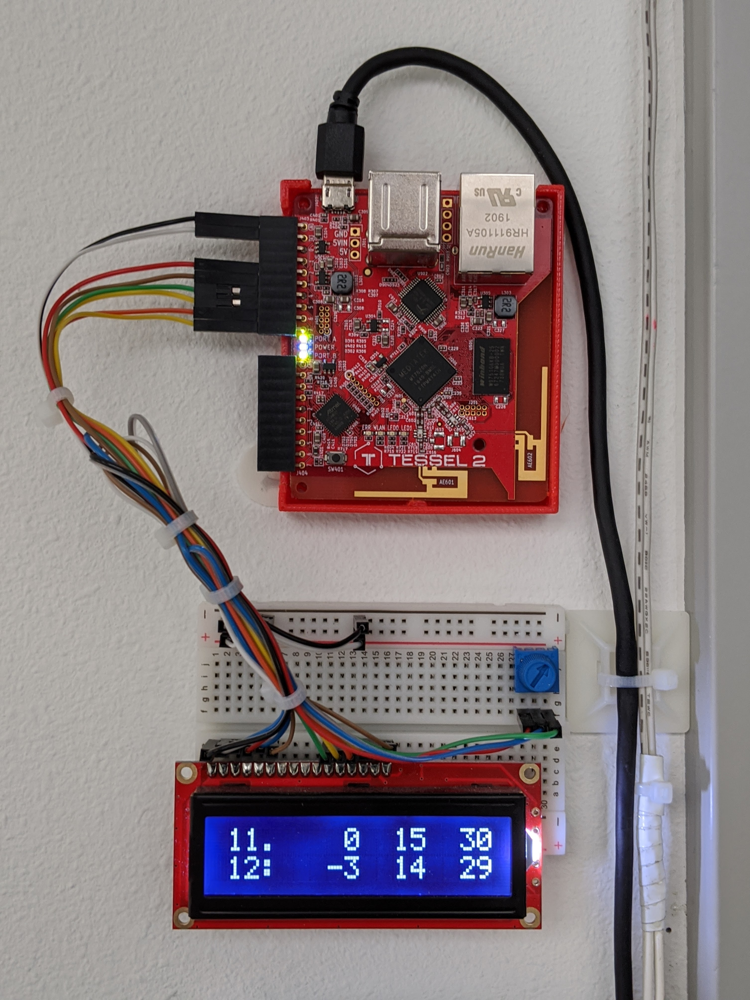
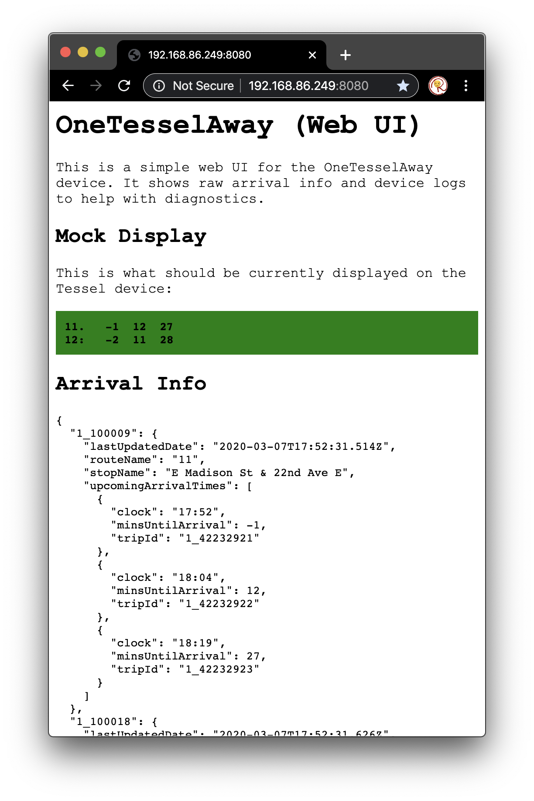

# OneTesselAway

I built a simple real-time transit board based on [OneBusAway](https://onebusaway.org/) and the [Tessel 2](https://tessel.io/). Why? Because I was tired of constantly checking my phone when waiting for the bus every morning.

Here's a photo of the device, which is mounted by my front door. The display shows:

-   Bus 11 is coming in 0 minutes (there now!), in 15 minutes, and in 30 minutes
-   Bus 12 left 3 minutes ago, but others are coming in 14 minutes, and in 29 minutes



This device includes a web UI where you can view the real-time contents of the display, raw OneBusAway response data, and device logs. By default, it runs on port 8080.



## Development

Here's how to develop on the OneTesselAway device.

### Prerequisites

1. [Request](https://www.soundtransit.org/help-contacts/business-information/open-transit-data-otd) a OneBusAway API key.

> To request an API key for the Puget Sound One Bus Away data send an email to oba_api_key@soundtransit.org. Please include the first and last names of the contact person, email address (if different) and acknowledgement that you have read and agree to the Transit Data Terms of Use. Please allow two business days for processing requests.

2. Put the API key in a file called `oba-api-key.json` at the root of the project under an `apiKey` property.

```json
{
    "apiKey": "xxxxxxxx-xxxx-xxxx-xxxx-xxxxxxxxxxxx"
}
```

3. Install the [Tessel 2 CLI](https://tessel.gitbooks.io/t2-docs/content/API/CLI.html#installation)
4. Install [NVM](https://github.com/nvm-sh/nvm)

### Run Unit Tests

Use the latest version of Node supported by the Tessel:

    nvm use

Run the tests:

    npm test

### Run OneTesselAway on Local Machine

You can run an instance of OneTesselAway on your local machine without the hardware at all.

    npm start

You can also use the following environment variables to configure how OneTesselAway runs.

-   `ADDR` - The address on which to run the Web UI
-   `PORT` - The port on which to run the Web UI
-   `DISABLE_DEVICE` - Run in web-only mode (disable device hardware)

E.g., to run the web UI on a different port:

    PORT=8081 npm start

### Run OneTesselAway on Tessel 2 Hardware

You can run an instance of OneTesselAway on the actual Tessel 2 hardware when connected via USB.

    npm run start:device

### Deploy to Tessel 2 Hardware

You can deploy and run the code on the Tessel 2 hardware. (Deploy is via USB by default.)

    npm run deploy

## Todo

-   Allow songs to be changed via Web UI
-   Extract audio library

## References

-   https://nodejs.org/docs/latest-v8.x/api/index.html (Latest supported by Tessel 2)
-   https://github.com/mde/ejs/tree/v3.0.1
-   https://github.com/rwaldron/johnny-five/blob/master/docs/lcd-16x2-tessel.md
-   https://learn.sparkfun.com/tutorials/experiment-guide-for-the-johnny-five-inventors-kit/experiment-2-multiple-leds-
-   https://tessel.gitbooks.io/t2-docs/content/API/Hardware_API.html#pwm-pins
-   http://johnny-five.io/api/led/
